<!-- > [!IMPORTANT]
> I'm currently seeking new opportunities! If you are hiring for Software Engineering internship / full-time roles, please feel free to check out my <a href="https://res.cloudinary.com/dpjhwcj4q/image/upload/resume_eshan_sud.pdf">resume</a> & reach out [here](mailto:eshansud22@gmail.com). -->

<!--  -->

Hi! I am Eshan Sud
=================================================================================================================================

<!--  -->

Software Engineer
-----------------

* 🌐 <a href="https://eshan-sud.vercel.app/" target="_blank">Portfolio</a>
* 🌍 I'm based in **New Delhi, India**
* ✉️ You can contact me at [eshansud22@gmail.com](mailto:eshansud22@gmail.com)
* 🎓 Currently a **B.Tech in Computer Science & Engineering with a minor in Data Analytics** at <a href="https://jaipur.manipal.edu/" rel="nofollow">Manipal University Jaipur</a>
* 💼 Currently **interning at Deloitte India** as a **PDI & CMS Intern**
* 📜 Published a patent in the **Indian Patent Office** titled; **A Method and a System of Real-Time Multi-Mode 3D Sparse SLAM System Using ORB-SLAM3 on an Embedded Platform**
* 📜 Published a patent in the **Indian Patent Office** titled; **An AI-Powered Digital Wardrobe Management and Context-Aware Outfit Recommendation System**
* 📖 Published 2 research papers in **IEEE Access**; one on ORB-SLAM3 & the other on Zero-Knowledge Proofs
* ⚡ Fun fact: I truely enjoy every time I get stuck on my code
* 🚀 Passionate about continuous learning & applying my knowledge to solve real-world problems
* 🤝 Looking forward to connecting with professionals & exploring opportunities to contribute to innovative projects
<!-- * 🌱 I'm currently exploring: Cloud technologies -->

Socials
-----------------

<a href="https://www.github.com/eshan-sud" target="_blank" rel="noreferrer">
    <picture>
        <source media="(prefers-color-scheme: dark)" srcset="https://raw.githubusercontent.com/danielcranney/readme-generator/main/public/icons/socials/github-dark.svg">
        <source media="(prefers-color-scheme: light)" srcset="https://raw.githubusercontent.com/danielcranney/readme-generator/main/public/icons/socials/github.svg">
        
    </picture>
</a>
<a href="https://www.linkedin.com/in/eshan-sud" target="_blank" rel="noreferrer">
    <picture>
        <source media="(prefers-color-scheme: dark)" srcset="https://raw.githubusercontent.com/danielcranney/readme-generator/main/public/icons/socials/linkedin-dark.svg">
        <source media="(prefers-color-scheme: light)" srcset="https://raw.githubusercontent.com/danielcranney/readme-generator/main/public/icons/socials/linkedin.svg">
        
    </picture>
</a>

Previously Interned At
-----------------
- Celebal Technologies Pvt. Ltd. as a Node.js Intern; where, I created an AI-chatbot system with intent recognition
- Exato Technologies Pvt. Ltd.; where, I contributed to several impactful live-projects
- About which you can read more about on my LinkedIn profile <a href="https://www.linkedin.com/in/eshan-sud/" target="_blank">here</a>

Languages & Tools
-----------------

<!--

  

-->

<!-- Anaconda, Android Studio, Arduino, Babel, Electron, Firebase, Godot, IPFS, Jenkins, Jest, Kafka, Matlab, Maven, Redhat, Stackoverflow, Supabase, Selenium, Solidity, Swift, Three.js, Unity, Unreal, Vercel, Google Colab, GitHub Actions, CMake, raspberrypi -->

    <!-- C --> 
    <!-- C++ --> 
    <!-- Git --> 
    <!-- Java --> 
    <!-- JavaScript --> 
    <!-- TypeScript --> 
    <!-- Python --> 
    <!-- HTML5 --> 
    <!-- CSS3 --> 
    <!-- Bootstrap CSS  -->
    <!-- Tailwind CSS --> 
    <!-- Linux --> 
    <!-- VS Code --> 
    <!-- React.js --> 
    <!-- React Native --> 
    <!-- Node.js --> 
    <!-- Express.js --> 
    <!-- Spring  -->
    <!-- Next.js --> 
    <!-- Redux.js --> 
    <!-- MySQL --> 
    <!-- MongoDB -->  <a href="https://www.mongodb.com/" target="_blank" rel="noreferrer"></a
    <!-- PostgreSQL --> 
    <!-- Postman --> 
    <!-- OpenCV --> 
    <!-- Bash --> 
    <!-- AWS  -->
    <!-- Google Cloud  -->
    <!-- Azure --> 
    <!-- Pandas --> 

<!-- PHP  -->
<!-- Flask  -->
<!-- PyTorch   -->
<!-- SciKitLearn  -->
<!-- Seaborn  -->
<!-- TensorFlow  -->
<!-- GraphQL  -->
<!-- Heroku  -->
<!-- Redis  -->
<!-- Django 
<!-- Docker  -->
<!-- Kubernetes  -->
<!-- Selenium  -->
<!-- Android  -->
<!-- Arduino  -->
<!-- Firebase  -->
<!-- Framer  -->
<!-- Angular.io  -->
<!-- Angular.io  -->
<!-- Angular.js  -->
<!-- Vue.js  -->
<!-- Mocha.js  -->
<!-- Electron.js  -->
<!-- Kafka  --->
<!-- Oracle  -->

Badges & GitHub Statistics
-----------------

<!--  -->
<!--  -->

    
      
    <picture>
        <source media="(prefers-color-scheme: dark)" srcset="profile/stats-dark.svg">
        
    </picture>
    <picture>
        <source media="(prefers-color-scheme: dark)" srcset="profile/top-langs-dark.svg">
        
    </picture>
    <!-- <picture>
        <source media="(prefers-color-scheme: dark)" srcset="profile/pin-dark.svg">
        
    </picture> -->

